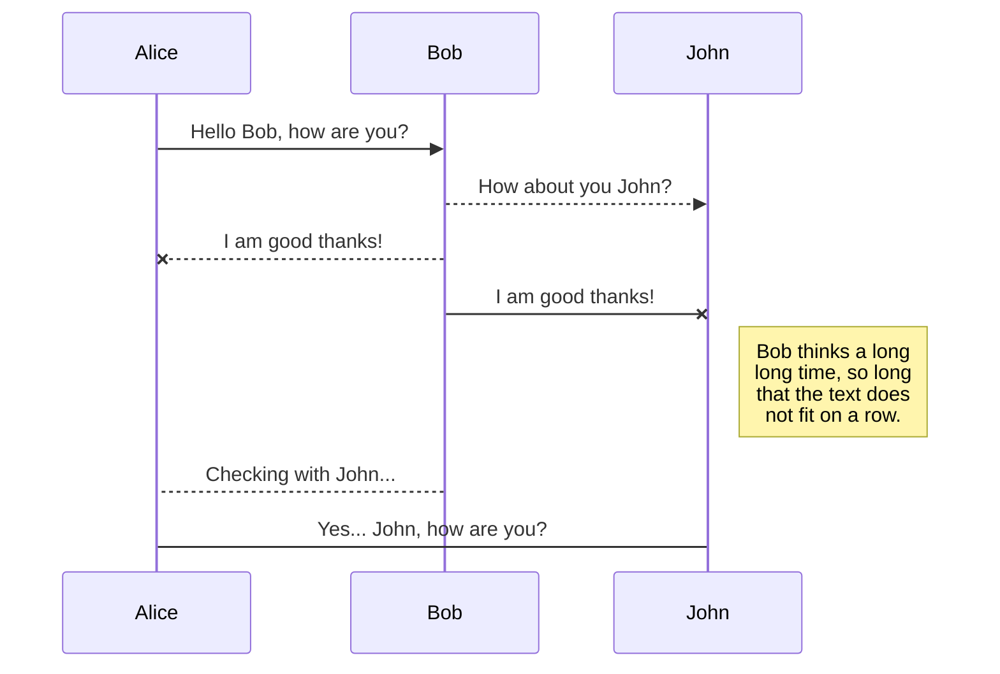
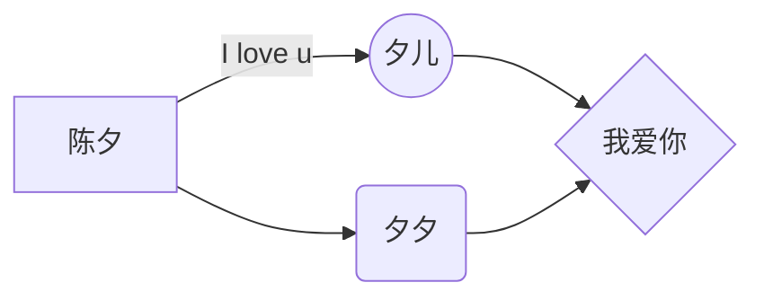

[TOC]

# Welcome to StackEdit!    
    
Hi! I'm your  面试题，推荐看这篇文章：
[https://blog.csdn.net/huangqili1314/article/details/72792682](https://blog.csdn.net/huangqili1314/article/details/72792682)
 
 
[我的知乎主页](https://www.zhihu.com/people/qydq)
  
> @StartTime：2019-03-23   
> @UpdataRecording：
>* 2019-04-04更新   
>* 2019-04-27更新
>
> @Email：qyddai@gmail.com
> @Author ： sunst /  qy   
 
 <font color=#0099ff size=4 face="黑体">失败是什么？没有什么，只是更走近成功一步；成功是什么？就是走过了所有通向失败的路，只剩下一条路，那就是成功的路。</font>
# 让人眼前一亮的Android面试题集锦（持续更新）  
    
本内容开始于2019-03-23，持续更新  
  
在开始整理该内容时，网上搜罗一大圈，发现很多内容都时间比较久远，内容不更新，而且有的错误，比如一篇文章介绍Android动画两种，但其实Android中有3中动画的
  
于带着前人的智慧和自己开发中的经验来整理一篇关于Android的面试题，题目就叫**让人眼前一亮的Android面试题集锦**  
  
当然不仅仅是为了面试而面试，通过整理这些能够总结之前的经验，提升自己的能力，同时也能分享一些好的idea给大家，我觉得非常有意义  
  
<font color=#ff0000 size=5 face="微软雅黑"><b>©️版权声明CopyRight：</b></font>

>**本内容作者：sunst，转载或引用请标明[出处](https://www.zhihu.com/people/qydq)，违者追究法律责任。**

[toc]
  
## 1. Android介绍  
Android是一个开源的操作系统，主要用于移动设备，比如手机，平板电脑，它是一种基于Linux的开放源代码软件栈，应用于ARM平台，但不仅限于ARM，通过编译控制，在X86等体系结构的机器上同样可以运行，并且它提供了丰富的组件，允许开发人员编写可执行基本和高级功能的应用程序。

**此处延伸：**
 * [Android不同架构的机器有何不同？](https://blog.csdn.net/kester_/article/details/71055901)
## 2. Android系统架构  
与其他操作系统一样，Android也采用分层的架构设计，从高到低分别是系统应用层（System Apps），Java API 框架层（Java API Framework），Android系统运行层（包括Android Runtime和Native C/C++ Libraries）、硬件抽象层（Hardware Abstraction Layer）、Linux内核层（Linux Kernel）。如下图所示：  
  
  
下面由上至下分别介绍各层  
  
### (1). 系统应用层  
所有安装在手机上的系统应用都属于这一层，用户自己开发的应用也属于这一层  
  
### (2). Java API 框架层  
Android OS的整个功能集可以通过用Java语言编写的API来获得，如：  
>* 一个丰富且可扩展的View System： 可以使用它来构建应用程序的UI，包括列表，网格，文本框，按钮，甚至可嵌入的Web浏览器；  
>* Content Providers： 可让应用访问其他应用的数据，例如通讯录应用，或共享自己的数据；  
>* Activity Manager： 负责管理应用程序的生命周期并提供一个通用的导航返回栈；  
>* Resource Manager： 提供对非编码资源，如本地字符串，图形，和布局文件；  
>* Notification Manager： 为应用程序提供在状态栏中显示自定义的消息提醒；  
  
### (3). Android系统运行层  
这一层包括Android Runtime和原生态的C/C++库。  
 * 原生态的C/C++库  
  
许多核心的Android系统组件和服务（如ART和HAL）都是使用本地代码构建的，需要使用C和C ++编写的本机库。  
Android平台提供的`Java框架API`将这些本地库中的一些功能展示给应用程序。 例如，您可以通过Android框架的Java OpenGL API访问OpenGL ES，以添加对在应用程序中绘制和操作2D和3D图形的支持。WebKit提供了浏览器支持等  
 * Android运行时  
  
包括了ART虚拟机（Android 5.0之前是Dalvik虚拟机，ART模式与Dalvik模式最大的不同在于，在启用ART模式后，系统在安装应用的时候会进行一次预编译AOT，先将代码转换为机器语言存储在本地，这样在运行程序时就不会每次都进行一次编译了，执行效率也大大提升。如果您的应用在 ART 上运行效果很好，那么它应该也可在 Dalvik 上运行，但反过来不一定。），每个Java程序都运行在ART虚拟机上，该虚拟机专门针对移动设备进行了定制，每个应用都有其自己的 Android Runtime (ART) 实例  
  
### (4). 硬件抽象层（Hardware Abstraction Layer）  
 硬件抽象层 （HAL）提供了将设备硬件功能展示给更高级`Java框架API`的标准接口。 HAL由多个库模块组成，其中每个模块都为特定类型的硬件组件（如相机或蓝牙模块）实现接口。 当框架API调用访问设备硬件时，Android系统会自动为该硬件组件加载库模块  
  
### (5). Linux内核层  
Android是基于Linux内核的（Linux内核提供了安全性、内存管理、进程管理、网络协议和驱动模型等核心系统服务），Linux内核层为各种硬件提供了驱动程序，如显示驱动、相机驱动、蓝牙驱动、电池管理等等  
  
## 3. Android的四大组件是哪些，它们的作用  
  
Activity：Activity是Android程序与用户交互的窗口，是Android构造块中最基本的一种，它需要为保持各界面的状态，做很多持久化的事情，妥善管理生命周期以及一些跳转逻辑  
  
Service：后台服务于Activity，封装有一个完整的功能逻辑实现，接受上层指令，完成相关的事物，定义好需要接受的Intent提供同步和异步的接口  
  
Content Provider：是Android提供的第三方应用数据的访问方案，可以派生Content Provider类，对外提供数据，可以像数据库一样进行选择排序，屏蔽内部数据的存储细节，向外提供统一的接口模型，大大简化上层应用，对数据的整合提供了更方便的途径  
  
BroadCast Receiver：接受一种或者多种Intent作触发事件，接受相关消息，做一些简单处理，转换成一条Notification，统一了Android的事件广播模型  
  
## 4. Activity的生命周期  
  
Activity的生命周期方法有：onCreate()、onStart()、onReStart()、onResume()、onPause()、onStop()、onDestory()；  
  
1、完整生命周期: 即从一个Activity从出现到消失，对应的周期方法是从onCreate()到onDestroy()  
  
2、可见生命周期: 当Activity处于可以用户看见的状态，但不一定能与用户交互时，将多次执行从onStart()到onStop()  
  
3、前景生命周期: 当Activity处于Activity栈最顶端，能够与其他用户进行交互时，将多次执行从onResume()到onPause()  

**如下例子**

 * A页面跳B页面，然后finish B  A生命周期：onPaused，onStop；onRestart，onResume

 - A页面按Home键  A生命周期：onPaused，onStop

## 5. 如果后台的Activity由于某原因被系统回收了，如何在被系统回收之前保存当前状态？

重写`onSaveInstanceState()`方法，在此方法中保存需要保存的数据，该方法将会在Activity被回收之前调用。通过重写`onRestoreInstanceState()`方法可以从中获取保存好的数据
  
## 6. Activity的启动模式有哪些？是什么含义？  
  
在Android里，有4种Activity启动模式，分别是 standard、singleTop、singleTask、singleInstance  
  
  - standard：标准启动模式，也是Android默认的启动模式  
  - singleTop：如果设置了该模式，当前的Acitivity如果存在任务栈顶，则不需要创建新的activity  
   - singleTask：如果设置了该模式，当前的Acitivity如果存在任务栈中，则不需要创建新的activity实例，并把这个activity之上的实例，通通出栈  
   - singleInstance：如果设置了该模式，当前的Acitivity如果存在该应用中的任何一个任务栈中，则不需要创建新的activity；  
## 7. 如何退出Activity？如何安全退出已调用多个Activity的Application？

对于单一Activity的应用来说，退出很简单，直接finish()即可。当然，也可以用killProcess()和System.exit()这样的方法。

对于多个Activity

> 1、**记录打开的Activity**：每打开一个Activity，就记录下来。在需要退出时，关闭每一个Activity即可
> 2、**发送特定广播**：在需要结束应用时，发送一个特定的广播，每个Activity收到广播后，关闭即可
> 3、**递归退出**：在打开新的Activity时使用startActivityForResult，然后自己加标志，在onActivityResult中处理，递归关闭

<font color=#0099ff size=4 face="黑体"><b>Tips：</b></font>

>为了编程方便，最好定义一个Activity基类，处理这些共通问题。
  
## 8. 请介绍下Android中常用的五种布局  
  
常用五种布局方式，分别是：FrameLayout（框架布局），LinearLayout （线性布局），AbsoluteLayout（绝对布局），RelativeLayout（相对布局），TableLayout（表格布局）。  
  
一、**FrameLayout**：所有东西依次都放在左上角，会重叠，这个布局比较简单，也只能放一点比较简单的东西。  
二、**LinearLayout**：线性布局，每一个LinearLayout里面又可分为垂直布局（android:orientation="vertical"）和水平布局（android:orientation="horizontal" ）。当垂直布局时，每一行就只有一个元素，多个元素依次垂直往下；水平布局时，只有一行，每一个元素依次向右排列。  
三、**AbsoluteLayout**：绝对布局用X,Y坐标来指定元素的位置，这种布局方式也比较简单，但是在屏幕旋转时，往往会出问题，而且多个元素的时候，计算比较麻烦。  
四、**RelativeLayout**：相对布局可以理解为某一个元素为参照物，来定位的布局方式
> 主要属性： 
> * 相对于某元素-> android:layout_below、 android:layout_toLeftOf
> * 相对于父元素-> android:layout_alignParentLeft、android:layout_alignParentRigh

五、**TableLayout**：表格布局，每一个TableLayout里面有表格行TableRow，TableRow里面可以具体定义每一个元素。每一个布局都有自己适合的方式，这五个布局元素可以相互嵌套应用，做出美观的界面  
  
## 9. Android中的动画有哪几类，它们的特点和区别是什么  
Android中动画有三类，分别是FrameAnimation，TweenAnimation，PropertyAnimation  
  
>* FrameAnimation（逐帧动画）：将多张图片组合起来进行播放，类似于早期电影的工作原理，很多App的loading是采用这种方式。  
>* TweenAnimation（补间动画）：是对某个View进行一系列的动画的操作，包括淡入淡出（Alpha），缩放（Scale），平移（Translate），旋转（Rotate）四种模式。  
>* PropertyAnimation（属性动画）：属性动画不再仅仅是一种视觉效果了，而是一种不断地对值进行操作的机制，并将值赋到指定对象的指定属性上，可以是任意对象的任意属性。  

  <font color=#0099ff size=4 face="黑体"><b>Tips：</b></font>
  >属性动画实现原理就是修改控件的属性值实现的动画  

  **此处延伸：**
  * [Android动画使用详解](https://blog.csdn.net/yanbober/article/details/46481171)  
## 10. 什么情况会导致Force Close ？如何避免？能否捕获导致其的异常？
程序出现异常，比如nullpointer，在logcat中能看到异常信息，找出异常信息并修改程序。

## 11. 什么是ANR 如何避免它？

ANR：Application Not Responsable。在Android中，Java API框架层的ActivityManager和WindowManager负责监视应用程序的响应，当用户操作的在5s内应用程序没能做出反应，BroadcastReceiver在10秒内没有执行完毕，就会出现应用程序无响应对话框，既ANR。

<font color=#0099ff size=4 face="黑体">避免方法：</font>Activity的关键生命周期方法（如onCreate()和onResume()）里尽可能少的去做创建操作，潜在的耗时操作。例如网络或数据库操作，或者高耗时的计算如改变位图尺寸，这些操作都应该在子线程里（或者异步方式）来完成。主线程应该为子线程提供一个Handler，以便完成时能够将任务提交给主线程。

  <font color=#0099ff size=4 face="黑体"><b>Tips：</b></font>
>腾讯发送消息19+15个句号发生ANR了

  **此处延伸：**

 - [Android内存泄漏分析与解决办法](我的知乎)

## 12. 运行时权限与文件系统权限的区别
运行时权限Android(`Dalvik`或`ART`)授权

文件系统权限`Linux`内核授权

## 13. Android dvm的进程和Linux的进程, 应用程序的进程是否为同一个概念

DVM指dalivk虚拟机。每一个Android应用程序都在它自己的进程中运行，都拥有一个独立的`Dalvik`或`ART`虚拟机实例。而每一个`DVM`或`ART`都是在Linux 中的一个进程，所以说可以认为是同一个概念。

## 14. 什么是嵌入式实时操作系统, Android 操作系统属于实时操作系统吗?

嵌入式实时操作系统是指当外界事件或数据产生时，能够接受并以足够快的速度予以处理，其处理的结果又能在规定的时间之内来控制**生产过程**或对系统作出快速响应，并控制所有**实时任务**协调一致运行的嵌入式操作系统。主要用于工业控制、 军事设备、 航空航天等领域对系统的响应时间有苛刻的要求，这就需要使用实时系统。又可分为软实时和硬实时两种，Android是基于Linux内核的，因此属于软实时。

## 15. 一条最长的短信息约占多少byte?

中文70(包括标点)，英文160，160个字节。

## 16. 如何将SQLite数据库(dictionary.db文件)与apk文件一起发布**

可以将dictionary.db文件复制到Android工程中的res aw目录中。所有在res aw目录中的文件不会被压缩，这样可以直接提取该目录中的文件。

## 17. 如何打开res aw目录中的数据库文件?

在Android中不能直接打开`res aw`目录中的数据库文件，而需要在程序第一次启动时将该文件复制到手机内存或SD卡的某个目录中，然后再打开该数据库文件。

复制的基本方法是使用`getResources().openRawResource`方法获得res aw目录中资源的 InputStream对象，然后将该InputStream对象中的数据写入其他的目录中相应文件中。在Android SDK中可以使用`SQLiteDatabase.openOrCreateDatabase`方法来打开任意目录中的SQLite数据库文件。

##  18. DDMS和TraceView的区别?

DDMS是一个程序执行查看器，在里面可以看见线程和堆栈等信息，TraceView是程序性能分析器 。

## 19. Java中如何引用本地语言

可以用JNI（java native interface java 本地接口）接口 

## 20. Android里的Intent传递的数据有大小限制吗，如何解决？

Intent传递数据大小的限制大概在1M左右，超过这个限制就会静默崩溃。处理方式如下：

-   进程内：EventBus，文件缓存、磁盘缓存。
    
-   进程间：通过ContentProvider进行跨进程数据共享和传递。
  
## 21. MVC设计模式  
  
<font color=#0099ff size=4 face="黑体">MVC模式的结构分为三部分，实体层的Model，视图层的View，以及控制层的Controller</font>  
  
-   View层其实就是程序的UI界面，用于向用户展示数据以及接收用户的输入  
-   Model层就是JavaBean实体类，用于保存实例数据  
-   Controller控制器用于更新UI界面和数据实例  
  
例如：View层接受用户的输入，然后通过Controller修改对应的Model实例；同时，当Model实例的数据发生变化的时候，需要修改UI界面，可以通过Controller更新界面；View层也可以直接更新Model实例的数据  
  
## ***22. MVP设计模式  
  
### 引入的场景  
  
MVP模式是MVC模式在Android上的一种变种，在Android的架构中Activity,Fragment布局的xml相当于View。实际的开发过程中，Activity和Fragment占据了大部分的开发工作，这就导致了在实际开发中View层太过耦合，一不小心，几次代码迭代过后，一个Activity或者Fragment中的代码就有几千行，有时候修改个功能在笨重的代码中摸爬滚打半天才找到关键点，对于不熟悉代码的开发者来说（或者接手前人编写代码的质量过低）维护起来及其困难，所以将视图和业务逻辑代码分开势在必行  
  
Google在Github上开源的<font color=#0099ff size=4 face="黑体">[todo-mvp](https://github.com/googlesamples/android-architecture/tree/todo-mvp/)</font>项目就是MVP的前身。这种设计模式（或者说代码结构）专门是为优化Activity和Fragment的代码而产生的，但这个模式并不就说一定就非常好，只不过有它的好处的初衷：  

  
>想让代码结构更加的清晰，逻辑耦合度降低  
  
### MVP的介绍  
MVP 全称是Model - View - Presenter ，是模型(model)－视图(view)－呈现器(presenter)的缩写  
  
>* <b>Model：</b><font color=#dd0000 size=4 face="黑体">业务逻辑和数据处理(数据库存储操作，网络数据请 求，复杂算法，耗时操作)</font>  
>* <b>View :</b> <font color=#dd0000 size=4 face="黑体">对应于Activity，负责View的绘制以及与用户交互</font>  
>* <b>Presenter：</b><font color=#dd0000 size=4 face="黑体">负责完成View于Model间的交互 (有一点还需要注意，presenter是双向绑定的关系，因此，在设计的时候就要注意接口和抽象的使用，尽可能的降低代码的耦合度，这也是mvp的宗旨)</font>  
  
按照MVC的分层，Activity和Fragment属于View层，用于展示UI界面，以及接收用户的输入，此外还要承担一些生命周期的工作。Activity是在Android开发中充当非常重要的角色，特别是TA的生命周期的功能，所以开发的时候我们经常把一些业务逻辑直接写在Activity里面，这非常直观方便，代价就是Activity会越来越臃肿，超过1000行代码是常有的事，而且如果是一些可以通用的业务逻辑（比如用户登录），写在具体的Activity里就意味着这个逻辑不能复用了。如果有进行代码重构经验的人，看到1000+行的类肯定会有所顾虑。因此，Activity不仅承担了View的角色，还承担了一部分的Controller角色，这样一来V和C就耦合在一起了，虽然这样写方便，但是如果业务调整的话，要维护起来就难了，所以有必要在Activity中，把View和Controller抽离开来，而这就是MVP模式的工作了  
  
<font color=#0099ff size=4 face="黑体">MVP模式的核心思想：</font>  
  
> MVP把Activity中的UI逻辑抽象成View接口，把业务逻辑抽象成Presenter接口，Presenter是Model和View之间的桥梁  
  
### MVP作用  
  
-   分离了视图逻辑和业务逻辑，降低了耦合  
  
-   Activity只处理生命周期的任务，代码变得更加简洁  
  
-   视图逻辑和业务逻辑分别抽象到了View和Presenter的接口中去，提高代码的可阅读性  
  
-   Presenter被抽象成接口，可以有多种具体的实现，所以方便进行单元测试  
  
-   把业务逻辑抽到Presenter中去，避免后台线程引用着Activity导致Activity的资源无法被系统回收从而引起内存泄露和OOM  
  
其中最重要的有三点：  
  
#### （1） Activity 代码变得更加简洁  
  
相信很多人阅读代码的时候，都是从Activity开始的，对着一个1000+行代码的Activity，看了都觉得难受。  
  
使用MVP之后，Activity就能瘦身许多了，基本上只有FindView、SetListener以及Init的代码。其他的就是对Presenter的调用，还有对View接口的实现。这种情形下阅读代码就容易多了，而且你只要看Presenter的接口，就能明白这个模块都有哪些业务，很快就能定位到具体代码。Activity变得容易看懂，容易维护，以后要调整业务、删减功能也就变得简单许多。  
  
#### （2）方便进行单元测试  
  
一般单元测试都是用来测试某些新加的业务逻辑有没有问题，如果采用传统的代码风格（习惯性上叫做MV模式，少了P），我们可能要先在Activity里写一段测试代码，测试完了再把测试代码删掉换成正式代码，这时如果发现业务有问题又得换回测试代码，咦，测试代码已经删掉了！好吧重新写吧……  
  
MVP中，由于业务逻辑都在Presenter里，我们完全可以写一个PresenterTest的实现类继承Presenter的接口，现在只要在Activity里把Presenter的创建换成PresenterTest，就能进行单元测试了，测试完再换回来即可。万一发现还得进行测试，那就再换成PresenterTest吧。  
  
#### ***（3）避免 Activity 的内存泄露  
  
Android APP 发生OOM的最大原因就是出现内存泄露造成APP的内存不够用，而造成内存泄露的两大原因之一就是Activity泄露（Activity Leak）（另一个原因是Bitmap泄露（Bitmap Leak））  
  
> Java一个强大的功能就是其虚拟机的内存回收机制，这个功能使得Java用户在设计代码的时候，不用像C++用户那样考虑对象的回收问题。然而，Java用户总是喜欢随便写一大堆对象，然后幻想着虚拟机能帮他们处理好内存的回收工作。可是虚拟机在回收内存的时候，只会回收那些没有被引用的对象，被引用着的对象因为还可能会被调用，所以不能回收  
  
Activity是有生命周期的，用户随时可能切换Activity，当APP的内存不够用的时候，系统会回收处于后台的Activity的资源以避免OOM  
  
采用传统的MVC模式，一大堆异步任务和对UI的操作都放在Activity里面，比如你可能从网络下载一张图片，在下载成功的回调里把图片加载到 Activity 的 ImageView 里面，所以异步任务保留着对Activity的引用。这样一来，即使Activity已经被切换到后台（onDestroy已经执行），这些异步任务仍然保留着对Activity实例的引用，所以系统就无法回收这个Activity实例了，结果就是Activity Leak。Android的组件中，Activity对象往往是在堆（Java Heap）里占最多内存的，所以系统会优先回收Activity对象，如果有Activity Leak，APP很容易因为内存不够而OOM。  
  
采用MVP模式，只要在当前的Activity的onDestroy里，分离异步任务对Activity的引用，就能避免 Activity Leak。  
  
### MVP使用示例  
以最常用的网络数据请求为例  
  
先来明确下MVP中各个环节的责任划分，然后照此进行代码布局  
  
责任划分：  
>* Model: 定义并实现获取数据操作(如数据库读取、网络加载)的接口  
>* View: 定义并在Activity,Fragment等中实现用于界面处理(初始化，数据展示)的接口  
>* Presenter: 定义用于调用Model中的数据请求方法的接口，实现此接口，并实现Model中定义的数据请求的接口  
  
通过上面的介绍，MVP的主要特点就是把Activity里的许多逻辑都抽离到View和Presenter接口中去，并由具体的实现类来完成  
#### Step 1/编写Model逻辑  
数据请求接口(如数据库读取、网络加载)的定义：  
```  
/**  
 * Model层接口---实现该接口的类负责实际的获取数据操作，如数据库读取、网络加载  
 */  
public interface IModel  {  
   void getData(Model.LoadDataCallback callback);  
}  
```  
数据请求接口的实现：  
```  
/**  
 * 实现IModel接口，负责实际的数据获取操作（数据库读取，网络加载等），然后通过自己的接口（LoadDataCallback）反馈出去  
 */  
public class Model implements IModel {  
  
    @Override  
    public void getData(final LoadDataCallback callback) {  
        //数据获取操作，如数据库查询、网络加载等  
        new Thread() {  
            @Override  
            public void run() {  
                try {  
                    //模拟耗时操作  
                    Thread.sleep(3000);  
                    //获取到了数据  
                    String data = "我是获取到的数据";  
                    //将获取的数据通过接口反馈出去  
                    callback.success(data);  
                } catch (InterruptedException e) {  
                    e.printStackTrace();  
                    //获取数据失败的回调  
                    callback.failure();  
                }  
            }  
        }.start();  
    }  
  
    /**  
     * 用于回传请求的数据的回传  
     */  
    public interface LoadDataCallback {  
  
        void success(String taskId);  
  
        void failure();  
    }  
}  
```  
#### Step 2/编写View逻辑  
定义用于界面处理(初始化，数据展示)的接口  
```  
/**  
 * View层接口---执行各种UI操作，定义的方法主要是给Presenter中来调用的  
 */  
public interface IView {  
  
    void showLoadingProgress(String message);  
  
    void showData(String text);  
}  
```  
在Activity,Fragment等中对接口的实现  
```  
/**  
 * 实现IView接口并实现各种UI操作的方法（其他的业务逻辑在Presenter中进行操作）  
 */  
public class ViewActivity extends AppCompatActivity implements IView {  
    private Button mBtnShowToast;  
    private TextView mText;  
    private MyHandler mHandler = new MyHandler(ViewActivity.this);  
    private IPresenter mPresenter;  
  
    @Override  
    protected void onCreate(Bundle savedInstanceState) {  
        super.onCreate(savedInstanceState);  
        setContentView(R.layout.activity_mvp);  
  
        //实例化Presenter，并将实现了IView接口的类传入进去  
        mPresenter = new Presenter(ViewActivity.this);  
  
        mBtnShowToast = findViewById(R.id.btn_show_toast);  
        mText = findViewById(R.id.text);  
  
        mBtnShowToast.setOnClickListener(new View.OnClickListener() {  
            @Override  
            public void onClick(View v) {  
                //通过Presenter来实现业务逻辑操作，View层只负责UI相关操作  
                mPresenter.loadData();  
            }  
        });  
    }  
  
    @Override  
    public void showLoadingProgress(final String message) {  
        mHandler.post(new Runnable() {  
            @Override  
            public void run() {  
                mText.setText(message);  
            }  
        });  
    }  
  
    @Override  
    public void showData(final String text) {  
        mHandler.post(new Runnable() {  
            @Override  
            public void run() {  
                mText.setText(text);  
            }  
        });  
    }  
  
    private static class MyHandler extends Handler {  
  
        //弱引用，防止内存泄露  
        WeakReference<ViewActivity> weakReference;  
  
        public MyHandler(ViewActivity activity) {  
            this.weakReference = new WeakReference<ViewActivity>(activity);  
        }  
  
        @Override  
        public void handleMessage(Message msg) {  
            switch (msg.what) {  
                case 1:  
                    weakReference.get().mText.setText(msg.what);  
                    break;  
            }  
        }  
    }  
}  
```  
#### Step 3/编写presenter逻辑(重点关注)  
presenter层很重要，为什么这样说呢？  
因为MVP模式中，View和Model是不直接交互的，而是通过presenter这个纽带来进行交互-----------View通过presenter对象来调用Model中数据请求的接口，而Model中数据请求的结果会通过presenter中定义的接口回调给presenter，然后presenter在通知给View。  
  
定义用于调用Model中的数据请求方法的接口：  
具体实现：  
```  
/**  
 * Presenter层接口---控制Model层的数据操作及调用View层的UI操作来完成“中间人”工作  
 */  
public interface IPresenter {  
  
    void loadData();  
  
}  
```  
定义用于调用Model中的数据请求方法的接口，实现此接口，并实现M中定义的数据请求的接口  
```  
/**  
 * Presenter层接口---控制Model层的数据操作及调用View层的UI操作来完成“中间人”工作.  
 * 用于model和view的相关方法的调用  
 */  
public class Presenter implements IPresenter, Model.LoadDataCallback {  
  
    private final IView mView;  
    private final Model mModel;  
  
    public Presenter(IView view) {  
        mView = view;  
        mModel = new Model();  
    }  
  
    @Override  
    public void loadData() {  
        mView.showLoadingProgress("加载数据中");  
        mModel.getData(Presenter.this);  
    }  
  
    @Override  
    public void success(String data) {  
        mView.showData(data);  
    }  
  
    @Override  
    public void failure() {  
  
    }  
}  
```  
大家要多看，多试验，最重要的是**理解思路**，Google官方的MVP代码大家可以去研读一下，是同一个模式，只不过它把好多接口集成在一个接口文件中，防止代码碎片化，大家研读时记住这一点，就不会困惑了。  
  
## 23. ListView的优化方案  
  
1、如果自定义适配器，那么在getView方法中要考虑方法传进来的参数contentView是否为null，如果为null就创建contentView并返回，如果不为null则直接使用。在这个方法中尽可能少创建view  
  
2、给contentView设置tag（setTag（）），传入一个viewHolder对象，用于缓存要显示的数据，可以达到图像数据异步加载的效果  
  
3、如果listview需要显示的item很多，就要考虑分页加载。比如一共要显示100条或者更多的时候，我们可以考虑先加载20条，等用户拉到列表底部的时候再去加载接下来的20条  
  
  <font color=#0099ff size=4 face="黑体"><b>Tips：</b></font>
>ListView已经过时了，现在使用RecycleView替代，RecycleView不仅能替代ListView还能替代GridView  
  
这里推荐一下我的两篇关于RecycleView的内容，你可以通过an系列框架快速集成非常绚丽的RecycleView，请一定要关注我的[知乎](https://www.zhihu.com/people/qydq/)  
  
* [RecyclerView解析之下拉刷新与上拉加载SwipeRefreshLayout（含分割线工具类）](https://zhuanlan.zhihu.com/p/22362839)  
  
* [ViewPager,RecyclerView,SrollView嵌套事件冲突解决](https://zhuanlan.zhihu.com/p/32748913)  
  
## ***24. Android的数据存储方式  
> * SharedPreferences存储； 
> * 文件存储； 
> * SQLite数据库存储； 
> * ContentProvider存储； 
> * 网络存储

Preference，File， DataBase这三种方式分别对应的目录是`/data/data/Package Name/Shared_Pref`,
`/data/data/Package Name/files`,
`/data/data/Package Name/database`
  
### （1）使用SharedPreferences存储数据  
  
首先说明SharedPreferences存储方式，它是 Android提供的用来存储一些简单配置信息的一种机制，例如：登录用户的用户名与密码。其采用了Map数据结构来存储数据，以键值的方式存储，可以简单的读取与写入，具体实例如下：  
#### sp写数据  
```  
SharedPreferences user = getSharedPreferences(“sun_info”,"0");  
user.edit();  
user.putString(“message”, "XiXi Love U");  
user.putString(“time” ,"forever");  
user.commit();  
```  
#### sp读数据  
```  
SharedPreferences user = getSharedPreferences("sun_info","0");`  
message = user.getString("message","陈夕");  
time = user getString(“time” ,"永远");  
```  
  
数据读取与写入的方法都非常简单，只是在写入的时候有些区别：先调用edit()使其处于编辑状态，然后才能修改数据，最后使用commit()提交修改的数据。实际上SharedPreferences是采用了XML格式将数据存储到设备中，在DDMS中的File Explorer中的/data/data/<package name>/shares_prefs下  
  
>使用SharedPreferences是有些限制的：只能在同一个包内使用，不能在不同的包之间使用。  

### （2）文件存储数据  
  
文件存储方式是一种较常用的方法，在Android中读取/写入文件的方法，与 Java中实现I/O的程序是完全一样的，提供了openFileInput()和openFileOutput()方法来读取设备上的文件。具体实例如下:  
  
`String fn = “moandroid.log”;`  
  
`FileInputStream fis = openFileInput(fn);`  
  
`FileOutputStream fos = openFileOutput(fn,Context.MODE_PRIVATE);`  
  
### （3）网络存储数据  
  
网络存储方式，需要与Android 网络数据包打交道，关于Android 网络数据包的详细说明，请阅读Android SDK引用了Java SDK的哪些package？。  
  
### （4）ContentProvider  
  
#### 1、ContentProvider简介  
  
当应用继承ContentProvider类，并重写该类用于提供数据和存储数据的方法，就可以向其他应用共享其数据。虽然使用其他方法也可以对外共享数据，但数据访问方式会因数据存储的方式而不同，如：采用文件方式对外共享数据，需要进行文件操作读写数据；采用sharedpreferences共享数据，需要使用sharedpreferences API读写数据。而使用ContentProvider共享数据的好处是统一了数据访问方式。  
  
#### 2、Uri类简介  
  
Uri代表了要操作的数据，Uri主要包含了两部分信息：1.需要操作的ContentProvider ，2.对ContentProvider中的什么数据进行操作，一个Uri由以下几部分组成：  
  
*  scheme：ContentProvider（内容提供者）的scheme已经由Android所规定为：content://…  
* 主机名（或Authority）：用于唯一标识这个ContentProvider，外部调用者可以根据这个标识来找到它  
  
 * 路径（path）：可以用来表示我们要操作的数据，路径的构建应根据业务而定，如下：  
  
要操作contact表中id为10的记录，可以构建这样的路径:/contact/10  
  
要操作contact表中id为10的记录的name字段， contact/10/name  
  
要操作contact表中的所有记录，可以构建这样的路径:/contact?  
  
要操作的数据不一定来自数据库，也可以是文件等他存储方式，如下:  
  
要操作xml文件中contact节点下的name节点，可以构建这样的路径：/contact/name  
  
如果要把一个字符串转换成Uri，可以使用Uri类中的parse()方法，如下：  
  
Uri uri = Uri.parse("content://com.changcheng.provider.contactprovider/contact")  
  
#### 3、UriMatcher、ContentUrist和ContentResolver简介  
  
因为Uri代表了要操作的数据，所以我们很经常需要解析Uri，并从 Uri中获取数据。Android系统提供了两个用于操作Uri的工具类，分别为UriMatcher 和ContentUris 。掌握它们的使用，会便于我们的开发工作。  
  
UriMatcher：用于匹配Uri，它的用法如下：  
  
1.首先把你需要匹配Uri路径全部给注册上，如下：  
  
`//常量UriMatcher.NO_MATCH表示不匹配任何路径的返回码(-1)。`  
  
`UriMatcher uriMatcher =` `new`  `UriMatcher(UriMatcher.NO_MATCH);`  
  
`//如果match()方法匹配content://com.changcheng.sqlite.provider.contactprovider /contact路径，返回匹配码为1`  
  
`uriMatcher.addURI(“com.changcheng.sqlite.provider.contactprovider”, “contact”, 1);``//添加需要匹配uri，如果匹配就会返回匹配码`  
  
`//如果match()方法匹配content://com.changcheng.sqlite.provider.contactprovider/contact/230路径，返回匹配码为2`  
  
`uriMatcher.addURI(“com.changcheng.sqlite.provider.contactprovider”, “contact/#”, 2);``//#号为通配符`  
  
2.注册完需要匹配的Uri后，就可以使用uriMatcher.match(uri)方法对输入的Uri进行匹配，如果匹配就返回匹配码，匹配码是调用 addURI()方法传入的第三个参数，假设匹配 content://com.changcheng.sqlite.provider.contactprovider/contact路径，返回的匹配码为1。  
  
ContentUris：用于获取Uri路径后面的ID部分，它有两个比较实用的方法：  
  
withAppendedId(uri, id)用于为路径加上ID部分  
  
parseId(uri)方法用于从路径中获取ID部分  
  
ContentResolver：当外部应用需要对ContentProvider中的数据进行添加、删除、修改和查询操作时，可以使用 ContentResolver 类来完成，要获取ContentResolver 对象，可以使用Activity提供的getContentResolver()方法。 ContentResolver使用insert、delete、update、query方法，来操作数据。  
  
## ***25. Activity的启动过程（不要回答生命周期）  
  
[Android启动过程远吗分析](http://blog.csdn.net/luoshengyang/article/details/6689748)  
  
在Android系统中，Activity和Service是应用程序的核心组件，它们以松藕合的方式组合在一起构成了一个完整的应用程序，这得益于应用程序框架层框架层提供了一套完整的机制来协助应用程序启动这些Activity和Service，以及提供Binder机制帮助它们相互间进行通信  
  
有两种操作会引发Activity的启动，一种用户点击应用程序图标时，Launcher会为我们启动应用程序的主Activity；应用程序的默认Activity启动起来后，它又可以在内部通过调用startActvity接口启动新的Activity，依此类推，每一个Activity都可以在内部启动新的Activity  
   
无论是通过点击应用程序图标来启动Activity，还是通过Activity内部调用startActivity接口来启动新的Activity，都要借助于应用程序框架层的ActivityManagerService服务进程
  <font color=#0099ff size=4 face="黑体">Tips:</font>

>Service也是由ActivityManagerService进程来启动的。在Android应用程序框架层中，ActivityManagerService是一个非常重要的接口，它不但负责启动Activity和Service，还负责管理Activity和Service  
>

  
下面介绍一下启动的过程  
* Step 1. 两种方式启动Activity，都通过Binder进程间通信进入到ActivityManagerService进程中，并且调用ActivityManagerService.startActivity接口；   
  
* Step 2. ActivityManagerService调用ActivityStack.startActivityMayWait来做准备要启动的Activity的相关信息；  
  
* Step 3. ActivityStack通知ApplicationThread要进行Activity启动调度了，这里的ApplicationThread代表的是调用ActivityManagerService.startActivity接口的进程，对于通过点击应用程序图标的情景来说，这个进程就是Launcher了，而对于通过在Activity内部调用startActivity的情景来说，这个进程就是这个Activity所在的进程了；  
  
 * Step 4. ApplicationThread不执行真正的启动操作，它通过调用ActivityManagerService.activityPaused接口进入到ActivityManagerService进程中，看看是否需要创建新的进程来启动Activity；  
  
 * Step 5. 对于通过点击应用程序图标来启动Activity的情景来说，ActivityManagerService在这一步中，会调用startProcessLocked来创建一个新的进程，而对于通过在Activity内部调用startActivity来启动新的Activity来说，这一步是不需要执行的，因为新的Activity就在原来的Activity所在的进程中进行启动；  
  
 * Step 6. ActivityManagerServic调用ApplicationThread.scheduleLaunchActivity接口，通知相应的进程执行启动Activity的操作；  
  
* Step 7. ApplicationThread把这个启动Activity的操作转发给ActivityThread，ActivityThread通过ClassLoader导入相应的Activity类，然后把它启动起来。  
  
这样，Android应用程序的Activity启动过程就启动起来了  
  
## ***26. Android进程间通信IPC机制Binder简单介绍  
在Android系统中，每一个应用程序都是由一些Activity和Service组成的，这些Activity和Service有可能运行在同一个进程中，也有可能运行在不同的进程中,那么，不在同一个进程的Activity或者Service是如何通信的呢？  
  
Binder是一种进程间通信机制，它是一种类似于COM和CORBA分布式组件架构，通俗一点，其实是提供远程过程调用RPC(Remote Procedure Call)功能。从英文字面上意思看，Binder具有粘结剂的意思，那么它把什么东西粘结在一起呢？  
  
在Android系统的Binder机制中，由一系统组件组成，分别是Client、Server、Service Manager和Binder驱动程序，  
  
>* Client、Server和Service Manager运行在用户空间；  
>* Binder驱动程序运行内核空间  
  
Binder就是一种把这四个组件粘合在一起的粘结剂了，其中，核心组件便是Binder驱动程序了，Service Manager提供了辅助管理的功能，Client和Server正是在Binder驱动和Service Manager提供的基础设施上，进行Client-Server之间的通信。Service Manager和Binder驱动已经在Android平台中实现好，开发者只要按照规范实现自己的Client和Server组件就可以了。  
  
说起来简单，做起难，对初学者来说，Android系统的Binder机制是最难理解的了，而Binder机制无论从系统开发还是应用开发的角度来看，都是Android系统中最重要的组成，因此，很有必要深入了解Binder的工作方式。要深入了解Binder的工作方式，最好的方式莫过于是阅读Binder相关的源代码了，Linux的鼻祖Linus Torvalds曾经曰过一句名言RTFSC：  
  
>Read The Fucking Source Code  
  
总结一下，Android系统Binder机制中的四个组件Client、Server、Service Manager和Binder驱动程序的关系如下图所示  
  
  
 * 1. Client、Server和Service Manager实现在用户空间中，Binder驱动程序实现在内核空间中  
* 2. Binder驱动程序和Service Manager在Android平台中已经实现，开发者只需要在用户空间实现自己的Client和Server  
* 3. Binder驱动程序提供设备文件/dev/binder与用户空间交互，Client、Server和Service Manager通过open和ioctl文件操作函数与Binder驱动程序进行通信  
 * 4. Client和Server之间的进程间通信通过Binder驱动程序间接实现  
 *  5. Service Manager是一个守护进程，用来管理Server，并向Client提供查询Server接口的能力  
  
至此，对Binder机制总算是有了一个感性的认识，但仍然感到不能很好地从上到下贯穿整个IPC通信过程，推荐下面四个情景，分析Binder源代码的文章，以进一步理解Binder机制  

> * [1. Service Manager是如何成为一个守护进程的？即Service
> Manager是如何告知Binder驱动程序它是Binder机制的上下文管理者](http://blog.csdn.net/luoshengyang/article/details/6621566)
> * [2. Server和Client是如何获得Service
> Manager接口的？即defaultServiceManager接口是如何实现的](http://blog.csdn.net/luoshengyang/article/details/6627260)
> * [3. Server是如何把自己的服务启动起来的？Service
> Manager在Server启动的过程中是如何为Server提供服务的？即IServiceManager::addService接口是如何实现的](http://blog.csdn.net/luoshengyang/article/details/6629298)
> * [4.  ServiceManager是如何为Client提供服务的？即IServiceManager::getService接口是如何实现的](http://blog.csdn.net/luoshengyang/article/details/6633311)
## ***28. Android 进程间通信的几种实现方式  
  
[# Android进程间通信 - 几种方式的对比总结](https://blog.csdn.net/hzw2017/article/details/81275438)  
  
[# Android面试收集录14 Android进程间通信方式](https://www.cnblogs.com/Jason-Jan/p/8459687.html)  
### 什么是RPC  
RPC（Remote Procedure Call）即远程过程调用，它是一种通过网络从远程计算机程序上请求服务，在不需要了解底层网络技术的协议下，即可获取计算机进程中的数据  
  
RPC使得开发包括网络分布式多程序在内的应用程序更加容易；RPC在OSI网络通信7层模型中，位于传输层与应用层之间，即位于会话层  
  
### 什么是IPC  
  
IPC 即 Inter-Process Communication (进程间通信)，是指进程间数据交互的过程  
  
Android底层是基于Linux，而Linux基于安全考虑，是不允许两个进程间直接操作对方的数据，这就是进程隔离。  
  
但Android没有继承Linux中的进程通信的方式，Android有着自己进程间通信方式。常用有如下几种：  
  
#### （1）Bundle （对应于四大组件）  
[详解Android 进程间通信-4种应用程序组件](https://blog.csdn.net/baidu_29094221/article/details/78852998)  
  
总结：  
  
>1. Activity，Service，Receiver 都支持在 Intent 中传递 Bundle 数据，而 Bundle 实现了 Parcelable 接口，可以在不同的进程间进行传输  
>2. 在一个进程中启动了另一个进程的 Activity，Service 和 Receiver ，可以在 Bundle 中附加要传递的数据，通过 Intent 发送出去。  
  
Example ：跨进程访问的Activity，例如，下面的代码可以直接调用拨打电话的Activity  
  
    Intent callIntent = new Intent(Intent.ACTION_CALL, Uri.parse("tel:13570**4685");
    startActivity(callIntent);  
#### （2）文件共享  
[参考Android进程通信 - 序列化Serialzable与Parcelable中的示例](https://blog.csdn.net/hzw2017/article/details/80978663)  
  
原理：  
>* 序列化是将对象转换成字节流，持久化保存在内存、文件、数据库中，序列化对象通过网络传输到其他客户端   
>  
>* 反序列化是将字节流转化成对象。 这样就可以通过文件共享实现进程通信  
  
总结：  
  
Serializable 和Parcelable都可以实现序列化进行数据传递。Serializable只需实现接口（保险点设置serialVersionUID值）即可，而Parcelable实现序列化使用则相对复杂些，当效率比Serializable高，Android底层做了相应的优化  
  
<font color=#0099ff size=4 face="黑体">Tips：保存到SD卡、数据库或网络传输一般使用Serializable序列化，虽然效率低些，但使用很方便。   
Intent、Bundle、Binder间的数据传递建议使用Parcelable，Android在这块做了内存序列化优化，效率高。</font>  
  
#### （3）ContentProvider（基于Binder）   
[Android进程间通信 - ContentProvider内容提供者](https://blog.csdn.net/hzw2017/article/details/81123791)  
  
ContentProvider可以跨进程访问其他应用程序中的数据（以Cursor对象形式返回），当然，也可以对其他应用程序的数据进行增、删、改操作，或共享自己的数据  
  
  
#### （4）AIDL Service（基于Binder）   
[Android进程通信 - AIDL的使用方法](https://blog.csdn.net/hzw2017/article/details/81048650)  
  
AIDL Service和Content Provider类似，也可以访问其他应用程序中的数据，   
但不同的是，ContentProvider返回的是Cursor对象，   
而Service返回的是Java对象，这种可以跨进程通讯的服务叫AIDL服务  
  
* 能自动生成Binder文件的工具，相当于工具  
#### （5）Messenger（基于Binder）   
* 类似于Hnadler发消息用法  
* [Android进程间通信 - Messenger的使用和理解](https://blog.csdn.net/hzw2017/article/details/81090319)  
  
[AIDL合Messenger对比使用](https://www.cnblogs.com/e007/p/6106482.html)  
#### （6）Socket（网络）   
[Android进程间通信 - Socket使用（TCP、UDP）](https://blog.csdn.net/hzw2017/article/details/81210979)  

## 29. 理解序列化吗，Android为什么引入Parcelable？

所谓序列化就是将对象变成二进制流，便于存储和传输。  
-   Serializable是java实现的一套序列化方式，可能会触发频繁的IO操作，效率比较低，适合将对象存储到磁盘上的情况。
    
-   Parcelable是Android提供一套序列化机制，它将序列化后的字节流写入到一个共性内存中，其他对象可以从这块共享内存中读出字节流，并反序列化成对象。因此效率比较高，适合在对象间或者进程间传递信息。
## 30. 什么是Service以及描述下它的生命周期。Service有哪些启动方法，有什么区别，怎样停用Service？  
### 描述：
Android Service是运行在后台的代码，不能与用户交互，可以运行在自己的进程，也可以运行在其他应用程序进程的上下文里。需要通过某一个Activity或者Context对象来调用

### 启动方法
[http://www.jianshu.com/p/2fb6eb14fdec](http://www.jianshu.com/p/2fb6eb14fdec)  

Service有两个启动方法，分别是

 1. Context.startService() 
 2. Context.bindService()

<font color=#0099ff size=4 face="黑体">Tips：</font>
>如果在Service执行耗时的操作需要启动一个新线程来执行。 
### 区别

* startService(): 调用者与服务之间没有关连，调用者退出后Service仍然存在。
* bindService(): 调用者与服务绑定在了一起，调用者一旦退出，Service也随即终止。
### 生命周期
Context.startService()方法启动服务，在服务未被创建时，系统会先调用服务的onCreate()方法，接着调用onStart()方法。如果调用startService()方法前服务已经被创建，多次调用startService()方法并不会导致多次创建服务，<b>但会导致多次调用onStart()方法</b>。采用startService()方法启动的服务，<b>只能调用Context.stopService()方法结束服务</b>，服务结束时会调用onDestroy()方法。

Context.bindService()方法启动服务，在服务未被创建时，系统会先调用服务的`onCreate()`方法，接着调用onBind()方法。这个时候调用者和服务绑定在一起，调用者退出了，系统就会先调用服务的onUnbind()方法，接着调用onDestroy()方法。<b>如果调用bindService()方法前服务已经被绑定，多次调用bindService()方法并不会导致多次创建服务及绑定</b>(也就是说onCreate()和onBind()方法并不会被多次调用)。<b>停用服务可以调用unbindService()方法</b>，服务结束时会调用服务的onUnbind()-->onDestroy()方法。

<font color=#0099ff size=5 face="黑体"><b>总结生命周期</b></font>
* onCreate() 在服务被创建时调用，无论调用多少次startService()或bindService()方法，该方法只会被调用一次。
* onDestroy()该方法在服务被终止时调用。
<b>1. 采用Context.startService()方法启动服务的生命周期</b>
onStart() 只有采用Context.startService()方法启动服务时才会回调该方法。该方法在服务开始运行时被调用。多次调用startService()方法尽管不会多次创建服务，但onStart() 方法会被多次调用。
<b>2. 采用Context.bindService()方法启动服务的生命周期</b>
onBind()只有采用Context.bindService()方法启动服务时才会回调该方法。该方法在调用者与服务绑定时被调用，当调用者与服务已经绑定，多次调用Context.bindService()方法并不会导致该方法被多次调用。onUnbind()只有调用Context.unbindService()方法启动服务时才会回调该方法。该方法在调用者与服务解除绑定时被调用
###

## 31. 注册广播有几种方式，这些方式有何优缺点？请谈谈Android引入广播机制的用意
[http://www.jianshu.com/p/ea5e233d9f43](http://www.jianshu.com/p/ea5e233d9f43)  
此处延伸：什么情况下用动态注册

<b>广播分两种</b>

 - 有序广播 可被拦截，可终止，可以修改数据   　　
 - 无序广播 是不可以被拦截掉的
### 注册广播方式
第一种：静态注册minifest
```
<receiver  
  android:name=".take.ApkInstallReceiver"  
  android:exported="false">  
    <intent-filter android:priority="1000">  
        <action android:name="sunst.installapk.APKINSTALLRECV" />  
    </intent-filter>  
</receiver>
```
第二种：动态注册activity
```
IntentFilter filter =  new IntentFilter("sunst.installapk.APKINSTALLRECV");  
ApkInstallReceiver receiver = new ApkInstallReceiver();  
registerReceiver(receiver.filter);
```
### 区别
|                |        静态注册               |动态注册                        |  
|----------------|-------------------------------|-----------------------------|  
|<b>静态注册</b> |`常驻型广播，不受组件生命周期影响，即便应用退出，广播还是可以被接收`            |非常驻型广播，跟随组件的生命变化，组件结束，广播结束。在组件结束前，需要先移除广播，否则容易造成内存泄漏            |  
|Quotes          |`"Isn't this fun?"`            |"Isn't this fun?"            |

###  广播发送和接收的原理
1.  继承BroadcastReceiver，重写onReceive()方法。
2.  通过Binder机制向ActivityManagerService注册广播。
3.  通过Binder机制向ActivityMangerService发送广播。
4.  ActivityManagerService查找符合相应条件的广播(IntentFilter/Permission)，将广播发送到BroadcastReceiver所在的消息队列中。
5.  BroadcastReceiver所在消息队列拿到此广播后，回调它的onReceive()方法。

## 32. BroadcastReceiver与LocalBroadcastReceiver有什么区别？

-   BroadcastReceiver 是跨应用广播，利用Binder机制实现。
    
-   LocalBroadcastReceiver 是应用内广播，利用Handler实现，利用了IntentFilter的match功能，提供消息的发布与接收功能，实现应用内通信，效率比较高。
## ***33. Service和Thread的区别？

Servie是系统的组件，它由系统进程托管（servicemanager）；它们之间的通信类似于client和server，是一种轻量级的ipc通信，这种通信的载体是binder，它是在linux层交换信息的一种ipc。而thread是由本应用程序托管。
1). Thread：Thread 是程序执行的最小单元，它是分配CPU的基本单位。可以用 Thread 来执行一些异步的操作。

2). Service：Service 是android的一种机制，当它运行的时候如果是Local Service，那么对应的 Service 是运行在主进程的 main 线程上的。如：onCreate，onStart 这些函数在被系统调用的时候都是在主进程的 main 线程上运行的。如果是Remote Service，那么对应的 Service 则是运行在独立进程的 main 线程上。

既然这样，那么我们为什么要用 Service 呢？其实这跟 android 的系统机制有关，我们先拿 Thread 来说。Thread 的运行是独立于 Activity 的，也就是说当一个 Activity 被 finish 之后，如果你没有主动停止 Thread 或者 Thread 里的 run 方法没有执行完毕的话，Thread 也会一直执行。因此这里会出现一个问题：当 Activity 被 finish 之后，你不再持有该 Thread 的引用。另一方面，你没有办法在不同的 Activity 中对同一 Thread 进行控制。

举个例子：如果你的 Thread 需要不停地隔一段时间就要连接服务器做某种同步的话，该 Thread 需要在 Activity 没有start的时候也在运行。这个时候当你 start 一个 Activity 就没有办法在该 Activity 里面控制之前创建的 Thread。因此你便需要创建并启动一个 Service ，在 Service 里面创建、运行并控制该 Thread，这样便解决了该问题（因为任何 Activity 都可以控制同一 Service，而系统也只会创建一个对应 Service 的实例）。

因此你可以把 Service 想象成一种消息服务，而你可以在任何有 Context 的地方调用 Context.startService、Context.stopService、Context.bindService，Context.unbindService，来控制它，你也可以在 Service 里注册 BroadcastReceiver，在其他地方通过发送 broadcast 来控制它，当然这些都是 Thread 做不到的。

## 34. 描述一下View的绘制原理？
View的绘制流程主要分为三步：

1.  onMeasure：测量视图的大小，从顶层父View到子View递归调用measure()方法，measure()调用onMeasure()方法，onMeasure()方法完成绘制工作。
    
2.  onLayout：确定视图的位置，从顶层父View到子View递归调用layout()方法，父View将上一步measure()方法得到的子View的布局大小和布局参数，将子View放在合适的位置上。
    
3.  onDraw：绘制最终的视图，首先ViewRoot创建一个Canvas对象，然后调用onDraw()方法进行绘制。onDraw()方法的绘制流程为：① 绘制视图背景。② 绘制画布的图层。 ③ 绘制View内容。  
    ④ 绘制子视图，如果有的话。⑤ 还原图层。⑥ 绘制滚动条。

以下两个讲解都讲得很透彻，这部分面试官多数不会问很深，要么就给你一个效果让你讲原理。 
（1）http://www.gcssloop.com/customview/CustomViewIndex 
（2）http://blog.csdn.net/yanbober/article/details/50577855


## 35. JAVA注解反射原理是什么
可以看我知乎

## 36. Java GC原理

参考：http://www.jianshu.com/p/d75a32ac5bed?


## 37. 设计模式


参考：http://gold.xitu.io/entry/56ebb4ad5bbb50004c440972

## 38. RxJava

http://gank.io/post/560e15be2dca930e00da1083?from=timeline&isappinstalled=0#toc_1

## 39. 介绍Http和Https的区别

http://www.jianshu.com/p/93fdebe5fef1

## 40.String,StringBuffer,StringBuilder的区别
本人知乎

[浅论String,StringBuffer,StringBuilder的区别](https://zhuanlan.zhihu.com/p/27323462)

## 41. 为什么要用ContentProvider？它和sql的实现上有什么差别？
ContentProvider可以像数据库一样进行选择排序，屏蔽内部数据的存储细节，向外提供统一的接口模型，用户只需要关心操作数据的uri就可以了，大大简化上层应用，对数据的整合提供了更方便的途径。

## 42. Android UI中的View如何刷新？

Android中对View的更新方式有很多种，使用时要区分不同的应用场合。要分清的是：多线程和双缓冲。

 - 1、不使用多线程和双缓冲

这种情况最简单，一般只希望View在发生改变时对UI进行重绘。你只需要Activity中显式调用View对象中的invalidate()方法即可。系统会自动调用View的onDraw()方法。

 - 2、使用多线程和不使用双缓冲

这种情况下需要开启新的线程，新开的线程就不好访问View对象了。强行访问的话会报错：

    android.view.ViewRoot$ CalledFromWrongThreadException: only theoriginal thread that created a view hierarchy can touch its views

这时候你需要创建一个继承了android.os.handler的子类，并重写handleMessage方法。在Activity中发出更新UI的消息，然后再在你的Handler(可以使用匿名内部类)中处理消息(因为匿名内部类可以访问父类变量，你可以直接调用View对象中的invalidate()方法。

也就是说：
>在新线程中创建并发送一个Message，然后在主线程中捕获、处理该消息

 - 3、使用多线程和双缓冲

Android的SurfaceView是View的子类，同时也实现了双缓冲。你可以定义一个它的子类并实现Surfaceholder.Callback接口。由于SurfaceHolder.Callback接口，新线程就不要android.os.Handler帮忙了。SurfaceHolder中lockCanvas()方法可以锁定画布，绘制完新的图像后调用unlockCanvasand Post解锁。
## 43. `requestLayout()`、`invalidate()`与`postInvalidate()`有什么区别？

-   requestLayout()：该方法会递归调用父窗口的requestLayout()方法，直到触发ViewRootImpl的performTraversals()方法，此时mLayoutRequestede为true，会触发onMesaure()与onLayout()方法，不一定  
    会触发onDraw()方法。
    
-   invalidate()：该方法递归调用父View的invalidateChildInParent()方法，直到调用ViewRootImpl的invalidateChildInParent()方法，最终触发ViewRootImpl的performTraversals()方法，此时mLayoutRequestede为false，不会  
    触发onMesaure()与onLayout()方法，当时会触发onDraw()方法。
    
-   postInvalidate()：该方法功能和invalidate()一样，只是**它可以在非UI线程中调用**。

一般说来需要重新布局就调用requestLayout()方法，需要重新绘制就调用invalidate()方法。

## 44. 了解APK的打包流程吗，描述一下？

Android的包文件APK分为两个部分：代码和资源，所以打包方面也分为资源打包和代码打包两个方面
具体说来：

1.  通过AAPT工具进行资源文件（包括AndroidManifest.xml、布局文件、各种xml资源等）的打包，生成R.java文件。
    
2.  通过AIDL工具处理AIDL文件，生成相应的Java文件。
    
3.  通过Javac工具编译项目源码，生成Class文件。
    
4.  通过DX工具将所有的Class文件转换成DEX文件，该过程主要完成Java字节码转换成Dalvik字节码，压缩常量池以及清除冗余信息等工作。
    
5.  通过ApkBuilder工具将资源文件、DEX文件打包生成APK文件。
    
6.  利用KeyStore对生成的APK文件进行签名。
    
7.  如果是正式版的APK，还会利用ZipAlign工具进行对齐处理，对齐过程就是将APK文件中所有的资源文件起始距离都偏移4字节的整数倍，这样通过内存映射访问APK文件的速度会更快。
## 45. 如何做性能优化？

1.  节制的使用Service，当启动一个Service时，系统总是倾向于保留这个Service依赖的进程，这样会造成系统资源的浪费，可以使用IntentService，执行完成任务后会自动停止。
    
2.  当界面不可见时释放内存，可以重写Activity的onTrimMemory()方法，然后监听TRIM_MEMORY_UI_HIDDEN这个级别，这个级别说明用户离开了页面，可以考虑释放内存和资源。
    
3.  避免在Bitmap浪费过多的内存，使用压缩过的图片，也可以使用Fresco等库来优化对Bitmap显示的管理。
    
4.  使用优化过的数据集合SparseArray代替HashMap，HashMap为每个键值都提供一个对象入口，使用SparseArray可以免去基本对象类型转换为引用数据类想的时间。
    

## 46. 如果防止过度绘制，如何做布局优化?

1.  使用include复用布局文件。
    
2.  使用merge标签避免嵌套布局。
    
3.  使用stub标签仅在需要的时候在展示出来。

## 47. 如何提交代码质量？

1.  避免创建不必要的对象，尽可能避免频繁的创建临时对象，例如在for循环内，减少GC的次数。
    
2.  尽量使用基本数据类型代替引用数据类型。
    
3.  静态方法调用效率高于动态方法，也可以避免创建额外对象。
    
4.  对于基本数据类型和String类型的常量要使用static final修饰，这样常量会在dex文件的初始化器中进行初始化，使用的时候可以直接使用。
    
5.  多使用系统API，例如数组拷贝System.arrayCopy()方法，要比我们用for循环效率快9倍以上，因为系统API很多都是通过底层的汇编模式执行的，效率比较高。
## 48. 有没有遇到64k问题，为什么，如何解决?

-   在DEX文件中，method、field、class等的个数使用short类型来做索引，即两个字节（65535），method、field、class等均有此限制。
    
-   APK在安装过程中会调用dexopt将DEX文件优化成ODEX文件，dexopt使用LinearAlloc来存储应用信息。

<font color=#0099ff size=4 face="微软雅黑"><b>Tips：</b></font>

> 关于LinearAlloc缓冲区大小，不同的版本经历了4M/8M/16M的限制，超出缓冲区时就会抛出INSTALL_FAILED_DEXOPT错误。
    
这个我没遇见过：回答解决方案就行了

解决方案是Google的MultiDex方案，具体参见：配置方法数超过64K的应用。

## 50. Android蓝牙技术

本人知乎

[android5.0 BLE 蓝牙4.0+浅析demo搜索（一）](https://zhuanlan.zhihu.com/p/23341414)
  
## UML diagrams  
  
You can render UML diagrams using [Mermaid](https://mermaidjs.github.io/). For example, this will produce a sequence diagram:  
  

  
And this will produce a flow chart:  
  

  
一生温暖纯良  
  
不舍爱与自由  
  
爱的是你，自由也是你all of you

---

2019-04-21 下面为知名互联网面试题

## 腾讯SNG（一二面）
### 1.Android Handler机制是做什么的，原理了解吗？
Tips：本篇作者晴雨qy，引用或转载必须标明出处，否则追究法律责任。

Android的Handler机制，其实就是Android的消息机制，下面我讲详细介绍，并从源码角度进行分析

众所周知，所有与UI控件的操作都要放在主线程即UI线程，而一些耗时操作应当放在子线程中。当在子线程中完成耗时操作并要对UI控件进行操作时，就要用Handler来分发消息

在单线程模型下，为了线程通信问题，Android设计了一个Message Queue(消息队列)， 线程间可以通过该Message Queue并结合Handler和Looper组件进行信息交换，主要是UI线程和子线程之间交互

主要涉及的角色如下所示：

-   Message：消息，分为硬件产生的消息（例如：按钮、触摸）和软件产生的消息。
-   MessageQueue：消息队列，主要用来向**消息池**添加消息和取走消息。
-   Looper：消息循环器，是Handler和消息队列之间通讯桥梁，主要用来把消息分发给相应的处理者，Looper中维护一个消息队列。
-   Handler：消息处理器，主要向消息队列发送各种消息以及处理各种消息。
***Tips：***
>MessageQueue存放通过Handler发布的消息，通常附属于某一个创建它的线程，可以通过Looper.myQueue()得到当前线程的消息队列，但该消息队列可能为NULL；Android会自动替UI线程建立Message Queue，所以调用Looper.getMainLooper()得到的主线程的Looper不为NULL

具体说来：

1.  Handler通过sendMessage()或post()发送消息Message到消息队列MessageQueue。
2.  Looper通过loop()不断提取触发条件的Message，并将Message交给对应的target handler来处理。
3.  target handler调用自身的handleMessage()方法来处理Message。


下面我们先看一下使用消息机制的一个简单实例
```
public class Activity extends Activity {  
    private Handler mHandler = new Handler(){  
        @Override  
        public void handleMessage(Message msg) {  
            super.handleMessage(msg);  
            System.out.println(msg.what);  
        }  
    };  
    @Override  
    public void onCreate(Bundle savedInstanceState, PersistableBundle persistentState) {  
        super.onCreate(savedInstanceState, persistentState);  
        setContentView(R.layout.activity_main);  
        new Thread(new Runnable() {  
            @Override  
            public void run() {  
                ...............耗时操作  
                Message message = Message.obtain();  
                message.what = 1;  
                mHandler.sendMessage(message);  
            }  
        }).start();  
    }  
}
```
在子线程中，进行耗时操作，执行完操作后，发送消息，通知主线程更新UI

####  消息机制的源码解析
#### 1.Handler发送消息
Handler可以通过sendXXX()或post()发送消息Message到MessageQueue，下面来跟踪一下源码
**post方法**
```
  
public final boolean post(Runnable r) {  
    return sendMessageDelayed(getPostMessage(r), 0);  
}  
public final boolean postAtTime(Runnable r, long uptimeMillis) {  
    return sendMessageAtTime(getPostMessage(r), uptimeMillis);  
}  
public final boolean postAtTime(Runnable r, Object token, long uptimeMillis) {  
    return sendMessageAtTime(getPostMessage(r, token), uptimeMillis);  
}  
public final boolean postDelayed(Runnable r, long delayMillis) {  
    return sendMessageDelayed(getPostMessage(r), delayMillis);  
}
```
**send方法**
```
public final boolean sendMessage(Message msg) {  
    return sendMessageDelayed(msg, 0);  
}  
public final boolean sendEmptyMessage(int what) {  
    return sendEmptyMessageDelayed(what, 0);  
}  
  
public final boolean sendEmptyMessageDelayed(int what, long delayMillis) {  
    Message msg = Message.obtain();  
    msg.what = what;  
    return sendMessageDelayed(msg, delayMillis);  
}  
public final boolean sendEmptyMessageAtTime(int what, long uptimeMillis) {  
    Message msg = Message.obtain();  
    msg.what = what;  
    return sendMessageAtTime(msg, uptimeMillis);  
}  
public final boolean sendMessageDelayed(Message msg, long delayMillis) {  
    if (delayMillis < 0) {  
        delayMillis = 0;  
    }  
    return sendMessageAtTime(msg, SystemClock.uptimeMillis() + delayMillis);  
}
```
通过源码分析，子线程中通过Handler的post()方式或send()方式发送Message消息，归根结底都是调用了`sendMessageAtTime()`方法

而且就连子线程中调用Activity中的runOnUiThread()更新UI，其实最终也会调用`sendMessageAtTime()`方法
```
public final void runOnUiThread(Runnable action) {  
    if (Thread.currentThread() != mUiThread) {  
        mHandler.post(action);  
    } else {  
        action.run();  
    }  
}
```
如果当前的线程不等于UI线程(主线程)，就去调用Handler的post()方法，最终会调用`sendMessageAtTime()`方法。否则就直接调用Runnable对象的run()方法
**Tips**
>网上有人说最终调用`sendMessageDelayed`这是错误的说法

下面我们来一探到底`sendMessageAtTime()`方法有什么作用
```
public boolean sendMessageAtTime(Message msg, long uptimeMillis) {  
    MessageQueue queue = mQueue;  
    if (queue == null) {  
        RuntimeException e = new RuntimeException(  
                this + " sendMessageAtTime() called with no mQueue");  
        Log.w("Looper", e.getMessage(), e);  
        return false;  
    }  
    return enqueueMessage(queue, msg, uptimeMillis);  
}
```
首先获取了Handler中的MessageQueue对象，若不为空，则调用`enqueueMessage()`方法，将Message插入到MessageQueue中
```
private boolean enqueueMessage(MessageQueue queue, Message msg, long uptimeMillis) {  
    msg.target = this;  
    if (mAsynchronous) {  
        msg.setAsynchronous(true);  
    }  
    //调用MessageQueue的enqueueMessage方法  
  return queue.enqueueMessage(msg, uptimeMillis);  
}
```
这里将message的目标(target)指向了该handler自己(this)，然后调用MessageQueue的enqueueMessage()方法，往消息队列中添加一个消息
```
boolean enqueueMessage(Message msg, long when) {  
    if (msg.target == null) {  
        throw new IllegalArgumentException("Message must have a target.");  
    }
    if (msg.isInUse()) {  
        throw new IllegalStateException(msg + " This message is already in use.");  
    }
    synchronized (this) {  
        if (mQuitting) {  
            IllegalStateException e = new IllegalStateException(  
                    msg.target + " sending message to a Handler on a dead thread");  
            Log.w(TAG, e.getMessage(), e);  
            msg.recycle();  
            return false;  
        }
        msg.markInUse();  
        msg.when = when;  
        Message p = mMessages;  
        boolean needWake;  
        if (p == null || when == 0 || when < p.when) {  
            msg.next = p;  
            mMessages = msg;  
            needWake = mBlocked;  
        } else {  
            needWake = mBlocked && p.target == null && msg.isAsynchronous();  
            Message prev;  
            for (;;) {  
                prev = p;  
                p = p.next;  
                if (p == null || when < p.when) {  
                    break;  
                }  
                if (needWake && p.isAsynchronous()) {  
                    needWake = false;  
                }  
            }  
            msg.next = p;  
            prev.next = msg;  
        }  
  
        if (needWake) {  
            nativeWake(mPtr);  
        }  
    }  
    return true;  
}
```
MessageQueue是按照Message触发时间的先后顺序排列的，当有消息需要加入消息队列时，会从队列头开始遍历，直到找到消息应该插入的合适位置，以保证所有消息的时间顺序。
**Tips**
>MessageQueue实际结构是一个Message类自身持有一个next形成的单向链表，他只是负责分发消息

#### 2.Looper获取消息
要想使用消息机制，首先要创建一个Looper。创建Looper需要初始化Looper，  无参情况下，默认调用`prepare(true)`表示的是这个Looper可以退出，而对于false的情况则表示当前Looper不可以退出。
```
public static void prepare() {  
    prepare(true);  
}
private static void prepare(boolean quitAllowed) {  
    if (sThreadLocal.get() != null) {  
        throw new RuntimeException("Only one Looper may be created per thread");  
    }  
    sThreadLocal.set(new Looper(quitAllowed));  
}
```
调用prepare()方法，会new 一个Looper对象把他传给sThreadLocal.set()方法，ThreadLocal是线程本地存储区（Thread Local Storage，简称为TLS），每个线程都有自己的私有的本地存储区域，不同线程之间彼此不能访问对方的TLS区域

而且代码里面可以看到只能创建一个Looper，再来看看set()方法是何用：
```
public void set(T value) {  
    Thread t = Thread.currentThread();  
    ThreadLocalMap map = getMap(t);  
    if (map != null)  
        map.set(this, value);  
    else  
  createMap(t, value);  
}
```
将一个数据用map保存在了当前线程中。再来看看Looper的构造方法
```
private Looper(boolean quitAllowed) {  
    mQueue = new MessageQueue(quitAllowed);  
    mThread = Thread.currentThread();  
}
```
前面我们给Looper默认传了一个true，在这个构造方法中，先创建了一个消息队列，然后又获取了当前线程，并把消息队列和该Looper对象关联起来，也就是前面提到的Looper是Handler和消息队列之间通讯桥梁
Looper创建好以后，接下来就是开启了。开启方法是loop()
```
public static void loop() {  
    final Looper me = myLooper();  //获取TLS存储的Looper对象   
	if (me == null) {  
        throw new RuntimeException("No Looper; Looper.prepare() wasn't called on this thread.");  
    }  
    final MessageQueue queue = me.mQueue;  //获取Looper对象中的消息队列
  Binder.clearCallingIdentity();  
    final long ident = Binder.clearCallingIdentity();  
    for (; ; ) { //进入loop的主循环方法  
  Message msg = queue.next(); //可能会阻塞,因为next()方法可能会无限循环  
    if (msg == null) { //消息为空，则退出循环  
  return;  }  
        Printer logging = me.mLogging;  //默认为null，可通过setMessageLogging()方法来指定输出，用于debug功能  
	if (logging != null) {  
            logging.println(">>>>> Dispatching to " + msg.target + " " +  
                    msg.callback + ": " + msg.what);  }  
        msg.target.dispatchMessage(msg); //获取msg的目标Handler，然后用于分发Message   
    if (logging != null) {  
            logging.println("<<<<< Finished to " + msg.target + " " + msg.callback);  
        }  
  
        final long newIdent = Binder.clearCallingIdentity();  
        if (ident != newIdent) {  
        }  
        msg.recycleUnchecked();  
    }  
}
```
代码太长，本神注释掉一些日志，通过myLooer()从当前线程中获取保存的Looper对象，loop()进入循环模式，不断的从queue中获取msg，然后调用msg的target的dispatchMessage()方法，target就是一个前面指向this的Handler对象，然后Handler就调用自身dispatchMessage()方法分发消息（我想到Android的事件分发机制dispatchtouchevent方法)。最后直到消息为空时退出循环
```
public void dispatchMessage(Message msg) {  
    if (msg.callback != null) {  
        handleCallback(msg);  
    } else {  
        if (mCallback != null) {  
            if (mCallback.handleMessage(msg)) {  
                return;  
            }  
        }  
        handleMessage(msg);  
    }  
}
```
可以看到这里是通过callback回调处理的，在Handler中通过handleMessage我们就能传递Message了

**Tips：**
>主线程在一开始创建时就已经创建并开启了Looper，所以我们在主线程中使用Handler时就已经和主线程、消息队列有了联系，就不用再手动调用loop()了,所以调用Looper.getMainLooper()得到的主线程的Looper不为NULL

#### Handler补充：

1. Handler在使用过程中，需要注意内存泄漏问题。

Handler是用来进行线程间通信的，新开启的线程是会持有Handler引用的，如果在Activity等中创建Handler，并且是非静态内部类的形式，就有可能造成内存泄漏。

非静态内部类是会隐式持有外部类的引用，当其他线程持有了该Handler，线程没有被销毁，则意味着Activity会一直被Handler持有引用而无法导致回收。
同时，MessageQueue中如果存在未处理完的Message，Message的target也是对Activity等的持有引用，也会造成内存泄漏。

 (1). 使用静态内部类+弱引用的方式:

静态内部类不会持有外部类的的引用，当需要引用外部类相关操作时，可以通过弱引用获取到外部类相关操作，弱引用是不会造成对象回收不掉的问题
```
private Handler sHandler = new TestHandler(this);
static class TestHandler extends Handler {
    private WeakReference<Activity> mActivity;
    TestHandler(Activity activity) {
        mActivity = new WeakReference<>(activity);
    }
    @Override
    public void handleMessage(Message msg) {
        super.handleMessage(msg);
        Activity activity = mActivity.get();
        if (activity != null) {
            //TODO:
        }
    }
}
```
(2). 在Activity的onDestroy方法中将MessageQueue中的消息清空
```
@Override 
protected void onDestroy() { 
handler.removeCallbacksAndMessages(null); 
super.onDestroy(); 
}
```
### 2.  Android的事件分发机制？
本人知乎：
[Android事件分发机制完全解析，带你从源码的角度彻底理解](https://zhuanlan.zhihu.com/p/32686674)

### 3. Java有哪几种创建新线程的方法及区别
[Java中创建线程主要有三种方式及其对比](https://zhuanlan.zhihu.com/p/32686674)
### 4.static修饰的方法可以被子类重写吗？为什么？
[Java关键字static、final使用小结](https://blog.51cto.com/android/384614)
### 5.如何优化一个ListView

参考上面优化ListView

>listview的优化其实就是去找getView中的耗时操作，然后提取出来，要么使用异步的方式为item的布局加载数据，若需要同步，就只能在Adapter初始化时将数据准备好，然后再getView中只需绑定一下就行

### 6.那些情况会导致OOM?
导致内存泄露主要的原因是，先前申请了内存空间而忘记了释放。如果程序中存在无用对象的引用，那么这些对象就会驻留内存，消耗内存，因为无法让垃圾回收器GC验证这些对象是否不再需要。如果存在对象的引用，这个对象就被定义为“有效的活动”，同时不会被释放。要确定对象所占内存将被回收，我们就要确认该对象不会再被使用。典型的做法是把对象数据成员设为null或者从集合中移除该对象。当出现以下情况时，会造成内存泄露:（当然不止这些，面试嘛，随便说一两个即可）

> 1、 数据库的cursor没有关闭
> 2、 构造adapter时，没有使用缓存contentview
> 3、 Bitmap对象不使用时，采用recycle()释放内存
> 4、 Activity中的对象的生命周期大于activity

本人知乎：

[# Android内存泄漏分析与解决办法-持新](https://zhuanlan.zhihu.com/p/32025826)
### 7.如何检测内存泄漏？有哪些工具？

查找内存泄漏可以使用Android Profiler工具或者利用LeakCanary工具。

具体可以看这一篇文章：
[# Android中的内存泄露检测方案LeakCanary远离OOM](
https://www.tuicool.com/articles/RvURJv)
### 8.用leak工具检测内存泄漏的原理是什么？
[# LeakCanary 内存泄露监测原理研究](https://www.jianshu.com/p/5ee6b471970e)