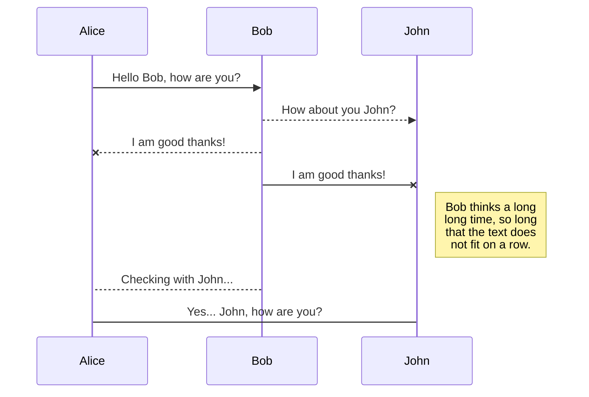
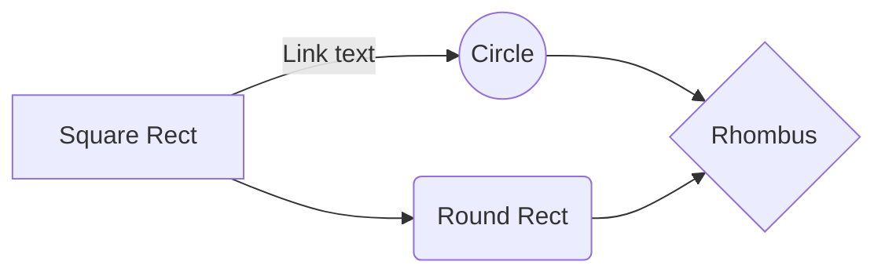

# Welcome to StackEdit!

Hi! I'm your first Markdown file in **StackEdit**. If you want to learn about StackEdit, you can read me. If you want to play with Markdown, you can edit me. Once you have finished with me, you can create new files by opening the **file explorer** on the left corner of the navigation bar.

# You have one of something

StackEdit stores your files in your browser, which means all your files are automatically saved locally and are accessible **offline!**

## Android是什么

Android是一个开源的操作系统，主要用于移动设备，比如手机，平板电脑，它是一种基于Linux的开放源代码软件栈，应用于ARM平台，但不仅限于ARM，通过编译控制，在X86等体系结构的机器上同样可以运行，并且它提供了丰富的组件，允许开发人员编写可执行基本和高级功能的应用程序
## Android系统架构
与其他操作系统一样，Android也采用分层的架构设计，从高到低分别是系统应用层（System Apps），Java API 框架层（Java API Framework），Android系统运行层（包括Android Runtime和原生态的C/C++库 Native C/C++ Libraries）、硬件抽象层（Hardware Abstraction Layer）、Linux内核层（Linux Kernel）。如下图所示： 

下面由上至下分别介绍各层
### 1. 系统应用层
所有安装在手机上的系统应用都属于这一层，用户自己开发的应用也属于这一层
### 2. Java API 框架层
Android OS的整个功能集可以通过用Java语言编写的API来获得，如：
>* 一个丰富且可扩展的View System： 可以使用它来构建应用程序的UI，包括列表，网格，文本框，按钮，甚至可嵌入的Web浏览器；
>* Content Providers： 可让应用访问其他应用的数据，例如通讯录应用，或共享自己的数据。
>* Activity Manager： 负责管理应用程序的生命周期并提供一个通用的导航返回栈；
>* Resource Manager： 提供对非编码资源，如本地字符串，图形，和布局文件；
>* Notification Manager： 为应用程序提供在状态栏中显示自定义的消息提醒；

### 3.  Android系统运行层
这一层包括Android Runtime和原生态的C/C++库。
* 原生态的C/C++库

许多核心的Android系统组件和服务（如ART和HAL）都是使用本地代码构建的，需要使用C和C ++编写的本机库。 
Android平台提供Java框架API以将这些本地库中的一些功能展示给应用程序。 例如，您可以通过Android框架的Java OpenGL API访问OpenGL ES，以添加对在应用程序中绘制和操作2D和3D图形的支持。WebKit提供了浏览器支持等
* Android运行时

包括了ART虚拟机（Android 5.0之前是Dalvik虚拟机，ART模式与Dalvik模式最大的不同在于，在启用ART模式后，系统在安装应用的时候会进行一次预编译AOT，在安装应用程序时会先将代码转换为机器语言存储在本地，这样在运行程序时就不会每次都进行一次编译了，执行效率也大大提升。如果您的应用在 ART 上运行效果很好，那么它应该也可在 Dalvik 上运行，但反过来不一定。），每个Java程序都运行在ART虚拟机上，该虚拟机专门针对移动设备进行了定制，每个应用都有其自己的 Android Runtime (ART) 实例
### 4. 硬件抽象层（Hardware Abstraction Layer）
 硬件抽象层 （HAL）提供了将设备硬件功能展示给更高级Java API框架的标准接口。 HAL由多个库模块组成，其中每个模块都为特定类型的硬件组件（如相机或蓝牙模块）实现接口。 当框架API调用访问设备硬件时，Android系统会自动为该硬件组件加载库模块
### 5. Linux内核层
Android是基于Linux内核的（Linux内核提供了安全性、内存管理、进程管理、网络协议和驱动模型等核心系统服务），Linux内核层为各种硬件提供了驱动程序，如显示驱动、相机驱动、蓝牙驱动、电池管理等等

	

## Rename a file

You can rename the current file by clicking the file name in the navigation bar or by clicking the **Rename** button in the file explorer.

## Delete a file

You can delete the current file by clicking the **Remove** button in the file explorer. The file will be moved into the **Trash** folder and automatically deleted after 7 days of inactivity.

## Export a file

You can export the current file by clicking **Export to disk** in the menu. You can choose to export the file as plain Markdown, as HTML using a Handlebars template or as a PDF.

# Synchronization

Synchronization is one of the biggest features of StackEdit. It enables you to synchronize any file in your workspace with other files stored in your **Google Drive**, your **Dropbox** and your **GitHub** accounts. This allows you to keep writing on other devices, collaborate with people you share the file with, integrate easily into your workflow... The synchronization mechanism takes place every minute in the background, downloading, merging, and uploading file modifications.

There are two types of synchronization and they can complement each other:

- The workspace synchronization will sync all your files, folders and settings automatically. This will allow you to fetch your workspace on any other device.
	> To start syncing your workspace, just sign in with Google in the menu.

- The file synchronization will keep one file of the workspace synced with one or multiple files in **Google Drive**, **Dropbox** or **GitHub**.
	> Before starting to sync files, you must link an account in the **Synchronize** sub-menu.

## Open a file

You can open a file from **Google Drive**, **Dropbox** or **GitHub** by opening the **Synchronize** sub-menu and clicking **Open from**. Once opened in the workspace, any modification in the file will be automatically synced.

## Save a file

You can save any file of the workspace to **Google Drive**, **Dropbox** or **GitHub** by opening the **Synchronize** sub-menu and clicking **Save on**. Even if a file in the workspace is already synced, you can save it to another location. StackEdit can sync one file with multiple locations and accounts.

## Synchronize a file

Once your file is linked to a synchronized location, StackEdit will periodically synchronize it by downloading/uploading any modification. A merge will be performed if necessary and conflicts will be resolved.

If you just have modified your file and you want to force syncing, click the **Synchronize now** button in the navigation bar.

> **Note:** The **Synchronize now** button is disabled if you have no file to synchronize.

## Manage file synchronization

Since one file can be synced with multiple locations, you can list and manage synchronized locations by clicking **File synchronization** in the **Synchronize** sub-menu. This allows you to list and remove synchronized locations that are linked to your file.

# Publication

Publishing in StackEdit makes it simple for you to publish online your files. Once you're happy with a file, you can publish it to different hosting platforms like **Blogger**, **Dropbox**, **Gist**, **GitHub**, **Google Drive**, **WordPress** and **Zendesk**. With [Handlebars templates](http://handlebarsjs.com/), you have full control over what you export.

> Before starting to publish, you must link an account in the **Publish** sub-menu.

## Publish a File

You can publish your file by opening the **Publish** sub-menu and by clicking **Publish to**. For some locations, you can choose between the following formats:

- Markdown: publish the Markdown text on a website that can interpret it (**GitHub** for instance),
- HTML: publish the file converted to HTML via a Handlebars template (on a blog for example).

## Update a publication

After publishing, StackEdit keeps your file linked to that publication which makes it easy for you to re-publish it. Once you have modified your file and you want to update your publication, click on the **Publish now** button in the navigation bar.

> **Note:** The **Publish now** button is disabled if your file has not been published yet.

## Manage file publication

Since one file can be published to multiple locations, you can list and manage publish locations by clicking **File publication** in the **Publish** sub-menu. This allows you to list and remove publication locations that are linked to your file.

# Markdown extensions

StackEdit extends the standard Markdown syntax by adding extra **Markdown extensions**, providing you with some nice features.

> **ProTip:** You can disable any **Markdown extension** in the **File properties** dialog.

## SmartyPants

SmartyPants converts ASCII punctuation characters into "smart" typographic punctuation HTML entities. For example:

|                |ASCII                          |HTML                         |
|----------------|-------------------------------|-----------------------------|
|Single backticks|`'Isn't this fun?'`            |'Isn't this fun?'            |
|Quotes          |`"Isn't this fun?"`            |"Isn't this fun?"            |
|Dashes          |`-- is en-dash, --- is em-dash`|-- is en-dash, --- is em-dash|

## KaTeX

You can render LaTeX mathematical expressions using [KaTeX](https://khan.github.io/KaTeX/):

The *Gamma function* satisfying $\Gamma(n) = (n-1)!\quad\forall n\in\mathbb N$ is via the Euler integral

$$
\Gamma(z) = \int_0^\infty t^{z-1}e^{-t}dt\,.
$$

> You can find more information about **LaTeX** mathematical expressions [here](http://meta.math.stackexchange.com/questions/5020/mathjax-basic-tutorial-and-quick-reference).

## UML diagrams

You can render UML diagrams using [Mermaid](https://mermaidjs.github.io/). For example, this will produce a sequence diagram:

And this will produce a flow chart:

